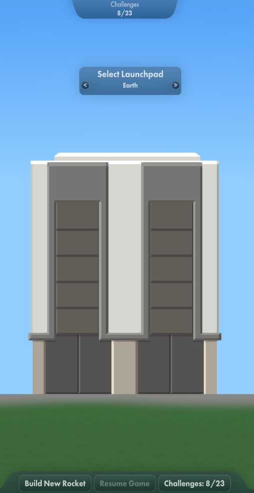

# Multi-Launchpad-SFS1

The mod adds support for alternate space centers to custom solar systems. In general, the planets that are expected to have an
alternate space center should have a flat area at the top with the correct terrain altitude. If it doesn't (like the default solar
system) it is possible to shift the location to find a flat-ish location but these may differ for different difficulties. You may
need to provide a space center for each difficulty. 

The height can be specified manually or omitted, in which case one will be chosen automatically. If both height and angle are
omitted the angle will be chosen automatically also. The automatic height/angle selection does not work very well if the slope is
too large, the terrain is too rough or the planet is too small.

To specify details you will need to add an Alternate\_Space\_Center\_Data.txt file:


If no Alternate\_Space\_Center\_Data.txt is supplied, a space centre definition will be generated for each significant planet that has
terrain, with angle and height chosen automatically and always enabled.

## Examples

### Example 1

Earth (two locations), Moon (multiple difficultlies) and Venus.

```
[
    {
      "enabled": 1,
      "difficulty":"all",
      "address": "Earth",
      "location": "Alternate",
      "angle": 91.0,
      "position_LaunchPad": {
        "horizontalPosition": 365.0,
        "height": 26.2
      }
    }
    ,{

      "enabled": 2,
      "difficulty":"normal",
      "address": "Moon",
      "angle": 91.0,
      "position_LaunchPad": {
        "horizontalPosition": 365.0,
        "height": 168.0
      }
    }
    ,{
      "enabled": 2,
      "difficulty":"hard",
      "address": "Moon",
      "angle": 91,
      "position_LaunchPad": {
        "horizontalPosition": 365.0,
        "height": 395.0
      }
    }
    ,{
      "enabled": 2,
      "difficulty":"realistic",
      "address": "Moon",
      "angle": 91,
      "position_LaunchPad": {
        "horizontalPosition": 365.0,
        "height": 2835.0
      }
    }
    ,{
      "enabled": 2,
      "address": "Venus",
      "angle": 90.0,
      "position_LaunchPad": {
        "horizontalPosition": 365.0,
        "height": 20.0
      }
    }
]
```

### Example 2

The definition that I currently using for the Free Academic Space Agency missions.
```
[
    {
      "enabled": 2,
      "address": "Moon",
      "location": "FASA Moonbase",
      "angle": 90.015
    }
    ,{
      "enabled": 2,
      "address": "Mars",
      "location": "FASA Mars Colony Left Pad",
      "angle": 90.237
     }
    ,{
      "enabled": 2,
      "address": "Mars",
      "location": "FASA Mars Colony Right Pad",
      "angle": 90.222
    }
    ,{
      "enabled": 2,
      "address": "Venus",
      "angle": 90.0
    }
    ,{
      "enabled": 2,
      "address": "Mercury",
      "angle": 89.4
    }
    ,{
      "enabled": 2,
      "address": "Callisto",
      "angle": 90.9
    }
    ,{
      "enabled": 2,
      "address": "Ganymede",
      "angle": 90.1
    }
    ,{
      "enabled": 2,
      "address": "Europa",
      "angle": 90.5
    }
    ,{
      "enabled": 2,
      "address": "Io",
      "angle": 91.6
    }
    ,{
      "enabled": 2,
      "address": "Titan",
      "angle": 90
    }
]
```

### Example 3

Most fields are optional and you can specify multiple planets with one definition. E.g. all significant planets with terrain,
excluding Phobos, Deimos and Jupiter, with automatic height and angle selection, enabled when the land and return safely challenge
for that planet is completed.
```
[
    {
      "enabled":2,
      "exclude":["Phobos","Deimos","Jupiter"]
    }
]
```

### Example 4

You can also specify the challenge id that will enable the launchpad. E.g. all moons of Jupiter, with automatic height and angle
selection, enabled when a flyby of the moon is completed. You will need the Custom Challenges mod to specify the flyby challenges.

```
[
    {
      "enabled":2,
      "challenge_id":"{planet}_FlyBy",
      "primaries":["Jupiter"]
    }
]
```

## Reference 

**"address":**

Specifies the name of the body where the space center is. If omitted will be for all significant bodies with terrain. If an
alternate launchpad is specfied more than once, the last one specified will be used.

**"inclInsignificant":**

When no address is specified, include bodies that are not marked as 'significant', default false.

**"exclude":**;

When no address is specified, exclude bodies in this array of names

        
**"primaries":**;

When no address is specified, only include bodies with primaries in this array of names

        
**"location":**

Specifies the name of an alternate location on the same body. If omitted will use the name "(default)".

**"enabled":**

0 - never enabled

1 - always enabled (default value if this field is omitted)

2 - enabled when a challenge is accomplished. N.B. if there is a planet called "Earth", a 'return safely' challenge will only be
counted when recovered on Earth. Otherwise it is counted when the rocket is recovered at the planet with the current launchpad.

**"challenge_id":**

The challenge id to be used with enabled=2, if omitted will be the "landed on planet and returned safely" challenge. If no value was
specified for "address", the string {planet} will be replaced with the name of the planet.

**"difficulty":**

"all" - used for all difficulties (default value  if this field is omitted)

"normal" - only used in the 'normal' difficulty

"hard" - only used in the 'hard' difficulty

"realistic" - only used in 'realistic' difficulty

**"angle":**

The location on the planet (in degrees) of the space center (not fully implemented by SFS, location is, orientation is not).
If this field is omitted and position\_LaunchPad or position\_LaunchPad.height is omitted will attempt to find a sufficiently flat
area. If this field is omitted and position\_LaunchPad.height is specified, 90 will be used.

**"position_LaunchPad":**

Position of the launch pad. If omitted will use default values for its fields:

>**"horizontalPosition":**
>
>Horizontal position the launch pad relative to the space center (meters) +ve right, default 0
>
>**"height":**
>
>Vertical position of the launch pad relative to the planet radius +ve up, if omitted, will attempt to find the best value

## UI

If the mod is installed a window will appear in the space center view:



The '\<' and '>' buttons at the top will switch the space center between the original (as specified in Space\_Center\_Data.txt) and the enabled alternates. The '\<' and '>' buttons at the bottom (only appear when the are multiple locations) will switch between locations on the planet.

## Known Limitations

Only the selected space center will exist in the game. Switching to a different one effectively 'teleports' the space center to a
different location. As a result, if you launch a rocket, leave it on the launchpad, change the space center and resume the game, the
rocket will fall to the ground.

The space center that is selected when entering a world is always the original (Space\_Center\_Data.txt) one.

You can only recover at the *currently selected* space center's  planet.

The "angle" field works as well as the "angle" field in Space\_Center\_Data.txt does. It specifies the position of the space center
but not its orientation, so if moved away from 90 the launch pad will appear tilted. It is best to try and move it no more that a
couple of degrees. A result of this is that any alternate locations need to be close to the 90 degree position - how close depends
on how much tilt you can live with.

The space center screen sometimes looks a little odd, expecially for planets/moons without an atmosphere.
